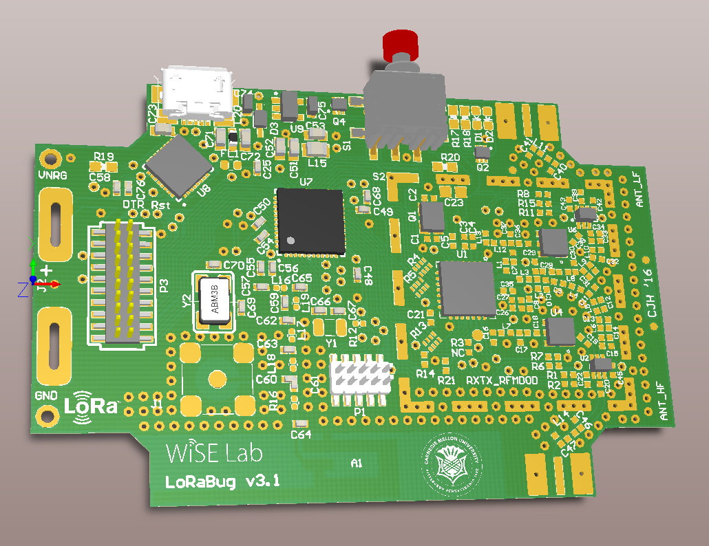

# Specs
* TI CC2650 MCU with BLE and 802.15.4 support
* SX1276 LoRa radio
* Provide 500mA 3.3V (3.3-3.4V) from USB.

# Board Details
* Pin mappings are detailed in the spreadsheet found [here](https://docs.google.com/spreadsheets/d/1lk55i37ZrpTx_7zy1oA4uAmHo3XsjOCir2L95xEN9fU/edit?usp=sharing).
* Board physical dimensions and header placement can be found [here](https://docs.google.com/drawings/d/1snO6Dwncqp3OL73APsFgQn0SESudZwlPjw8W5KeOZVo/edit?usp=sharing).
* You can find other information, such as the schematic and board renderings, in the [Info](Info/) directory.

# Firmware Notes
* You can detect the presence of a USB by checking if the FTDI TX and RX
  pins are high. When the FTDI chip is activated, it pulls the TX and RX
  lines high.
  Additionally, this means the CC2650 should use push/pull and no pull-ups 
  when communicating with the FTDI.

# Info
* The power supported by the USB is limited by the 500mA limit of diode D3 and the 600mA limit of the voltage regulator U9.
* When using USB power, the 3.3V rail may swing to 3.4V. This is due to the linear regulator's ground pin voltage being raised by the inline mosfet Q4.
* The SX1276 is said to be only able to support PA_BOOST +20dBm TX when the input voltage is greater than 2.4V. See section 5.4.3 in the [SX1276 datasheet][sx1276_datasheet].

# Low Power Profile
Other than the reverse leakage current, these values are totally unconfirmed. The values are pulled straight from the [datasheet][sx1276_datasheet].

* Reverse leakage from battery through voltage regulation circuitry has shown to draw upwards of **80 nA**. Based on the datasheets, there is a possibility of 0.1 - 0.2uA draw.
* [CC2650][cc2650_overview]
    - Normal operation between 1.8 V and 3.8 V
    - The main MCU crystal is 24 MHz, which is doubled internally. There is also a 32 kHz clock for BLE. See section 6.9 in [overview datasheet][cc2650_brief_datasheet].
    - Active-Mode draws **61 uA/MHz**
    - Active-Mode Sensor Controller draws **8.2 uA/MHz**
    - Standby draws **1 uA** (RTC Running and RAM/CPU Retention)
    - Shutdown draws **100 nA** (Wake Up on External Events)
    - Active-Mode RX draws **5.9 mA**
    - Active-Mode TX at 0 dBm draws **6.1 mA**
    - Active-Mode TX at +5dBm draws **9.1 mA**
    - The sensor controller(when cpu freq. scalled) consumes less power than the [MSP430G2X][msp430_overview], which consumes 220 uA/MHz in active-mode and 0.7 uA in RTC mode.
* [SX1276][sx1276_overview]
    - Up to +17 dBm of RF output power which is maintained from 1.8 V to 3.7 V and +20 dBm from 2.4 V to 3.7 V. See section 5.1 of [datasheet][sx1276_datasheet].
    - We have PA_BOOST connected to the HF (high frequency) side antenna. This means we output 915MHz HF signals through PA_BOOST.
    - LoRa HF RX mode draws **10.3 mA**(125kHz bw) or **12.6 mA**(500kHz bw) with LNABoost off. See sections 2.5.1 and 2.5.5 of [datasheet][sx1276_datasheet].
    - LoRa HF TX mode draws around **90 mA** for +17dBm PA_BOOST and somewhere around **120 mA** for +20dBm PA_BOOST.
    - Sleep mode draws **0.2 uA**
    - Idle mode (RC oscillator enabled) draw **1.5 uA**
    - Standby mode (Crystal oscillator enabled) draw **1.6 mA**

# Changelog
* V3.1
    - Removed inverter and pullup/pulldown resistors from LoRa radio module for power saving
    - Mapped RF_CTRL1 and RF_CTRL2 as complement control pair for RF switches for power saving
    - Resolved SX1276 crystal caps manufacturing issue
* V3
    - Changed IO header to a 20pin 1.27mm for ease of use
    - Access to VCC_NREG, the power feeding the onboard regulator
    - Active low button
    - FTDI TX/RX lines pulled into header
    - Removed onboard I2C resistors
* V2
    - Fixed button NC/NO leads. Pulldown now pulls the signal low as initially designed.
    - Fixed leakage current through the linear regulator
    - Changed FTDI footprint to have longer leads for hand soldering
    - Used a single dual N-channel mosfet chip to control LEDs
    - Changed the fiducial location
    - Changed some components to consolidate count
* V1 - Initial Release

# Contribution Info

## Generating Manufacturer Files
To generate the manufacturer files for APCircuits.com, you need to generate the Gerbers(with outline), Aperture file, and NC Drill file.

To generate the gerbers and aperture files, do the following:
1. Click File -> Fabrication Output -> Gerber Files, when viewing a PCB Layout.
2. Make sure that Top Overlay, Top Paste, Top Solder, Top Layer, Bottom Layer, Bottom Solder, Bottom Overlay(optional), and Mechanical 1 are selected in the Layers tab.
3. Do not have anything selected in the Drill Drawing tab, and make sure that "Embedded aperture (RS274X)" is selected in the Aperture tab.
4. Press Ok.

To generate the NC Drill File, do the following:
1. Click File -> Fabrication Output -> NC Drill Files, when viewing a PCB Layout.
2. Just click Ok to the default settings.

To generate the pick and place coordinates file:
1. Click File -> Assembly Outputs -> Generate pick and place files
2. Ensure only the Text and Imperial options are checked and click Ok

The previous operations place all the output files in the "Project Output for LoRaBugBoard" directory.
You now just need to combine the following list of file into a zip archive. Make sure to copy in the
README.txt from previous archives.

Archive File List:

* PCBFireflyCaseV3.apr
* PCBFireflyCaseV3.DRR
* PCBFireflyCaseV3.GBL
* PCBFireflyCaseV3.GBO
* PCBFireflyCaseV3.GBS
* PCBFireflyCaseV3.GM1
* PCBFireflyCaseV3.GTL
* PCBFireflyCaseV3.GTO
* PCBFireflyCaseV3.GTP
* PCBFireflyCaseV3.GTS
* PCBFireflyCaseV3-RoundHoles.TXT
* PCBFireflyCaseV3-SlotHoles.TXT
* Pick Place for PCBFireflyCaseV3.txt
* README.txt

## Testing the Hardware
* ***Test FTDI, System UART, Bootloader Backdoor Trigger, and Onboard Voltage Regulator***
  Ensure that the bootloader backdoor is configured to use the button. Ensure R20 is low enough to not trigger the bootloader after reset.
  I previously had an issue where the pulldow(at the time) wasn't strong enough. Next, ensure you can actually enter the bootloader during reset.
  To aid in this, I created a script called [trigger_bootloader.sh](Info/trigger_bootloader.sh) in the Info directory that sends the initialization
  bytes to serial repeatedly. If you cat the serial device at the same time, you should see the bootloader respond.
  Maybe do a `stty -F /dev/ttyUSB0 115200 && cat /dev/ttyUSB0 | hd`. Checkout the [CC2650 Bootloader Spec][cc2650_bootloader_spec].
* ***Test LEDs***
* ***Test Pins in GPIO Hedaer***
* ***Test Debugging CC2650 Over Cortex Debug Header***
* ***Test SX1276 Front End***

# Antennas

| Description | Part Name   | Manufacturer | Connector |
| ------------| ----------- | ------------ | --------- |
| Standard yellow 915MHz LoRa 5.591" 1.2dBi | [NT-916-CW-HWR-SMA](http://www.linxtechnologies.com/resources/data-guides/ant-916-cw-hwr.pdf) | Linx Technologies | SMA-Male |
| 4.256" 900MHz 3.0dBi | [APAMS-118](http://abracon.com/external-antenna/APAMS-118.pdf) | Abracon LLC | SMA-Male |

# Accessories

The board was designed to accept an **RFI shield** over the LoRa radio components.
You can solder on a static can or use the two part removable can.
* Static can [BMI-S-103](http://www.digikey.com/products/en?keywords=BMI-S-103). The preferred low-profile can is the BMI-S-111 by Laird.
* Removable two part: The frame is [BMI-S-203-F](http://www.digikey.com/products/en?keywords=BMI-S-203-F) and the cover is [BMI-S-203-C](http://www.digikey.com/products/en?keywords=BMI-S-203-C).

The I/O header is a standard 1.27mm 2x10 pin header.
You can use the [Harwin M50-3121045](http://www.digikey.com/products/en?keywords=M50-3121045) to interface with it.

[cc2650_overview]: http://www.ti.com/product/CC2650
[cc2650_brief_datasheet]: http://www.ti.com/lit/ds/symlink/cc2650.pdf
[sx1276_overview]: http://www.semtech.com/wireless-rf/rf-transceivers/sx1276/
[sx1276_datasheet]: http://www.semtech.com/images/datasheet/sx1276_77_78_79.pdf
[msp430_overview]: http://www.ti.com/lsds/ti/microcontrollers_16-bit_32-bit/msp/ultra-low_power/msp430g2x_i2x/overview.page
[cc2650_bootloader_spec]: http://www.ti.com/lit/an/swra466a/swra466a.pdf
